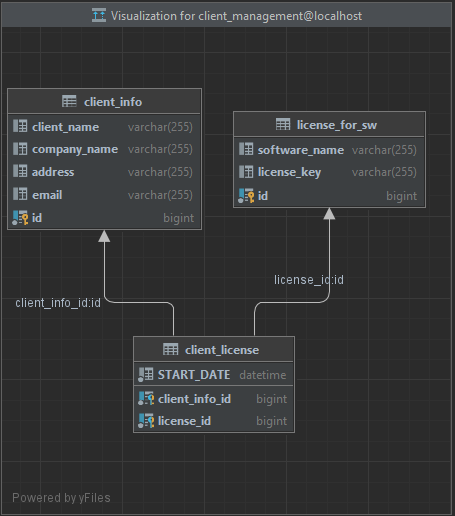

# Client - Management

## Overview

The Restaurant Management System is a Spring Boot-based application that provides
a set of CRUD (Create, Read, Update, Delete) operations for managing clients,license of software(sw)
with license key for specific sw and client license. Its used relations in database.
These license keys are generating regularly on Monday midnight and are sending on clients by email.
New generated license keys are saving to licenses.txt file.

## Technologies Used

- **Framework:** Spring Boot 3
- **Language:** Java 17
- **Database:** MySQL
- **Database Migration:** Flyway
- **Build Tool:** Maven
- **Batch Processing:** Spring Batch 5.0
- **API Testing:** Postman
- **Email Handling:** JavaMail API
- **Unit Testing Framework:** JUnit.
- **Mocking Framework** Mockito.

## Dependencies

The project utilizes the following dependencies:

- **Spring Boot Starter Data JPA**: Simplifies database access using Spring Data repositories.

- **Spring Boot Starter Web**: Provides support for building web applications, including RESTful APIs.

- **MySQL Connector/J (Runtime Dependency)**: The MySQL JDBC driver for connecting to MySQL databases.

- **Flyway**: Handles database schema migration to manage changes over time.

- **Project Lombok (Optional)**: A library for reducing boilerplate code, such as getters and setters.

- **Spring Boot Starter Test (For Testing)**: Provides support for testing Spring Boot applications.

- **Spring Boot Starter Validation**: Includes validation support for request data binding and response data rendering.

- **JavaMail API**: Used for sending emails.

- **Postman**: Utilized for API testing and development.

- **JUnit:** A popular unit testing framework for Java.

- **Mockito:** A mocking framework that allows the creation of mock objects in unit tests.

## Data Flow

### Controller

| Controller                | Functions Used                                                                                                                                                                                                                                                                                                 |
|---------------------------|----------------------------------------------------------------------------------------------------------------------------------------------------------------------------------------------------------------------------------------------------------------------------------------------------------------|
| `ClientController`        | - `addClient`: Add a new client.<br/> - `getClientByName`: Read client info by name.     <br/>- `updateClientByName`: Change client info by name.<br/> - `deleteClientByName`: Remove client info and all licenses by name.                                                                                    |
| `ClientLicenseController` | - `createClientLicense`: Add license of software for client by client name.<br/> - `getActiveClientLicense`: Read all licenses from db.<br/> - `getLicenseByClientId&LicenseId`: Read license by client name and software name.<br/> - `deleteClietnLicense`: Remove license by client name and software name. |
| `EmailController`         | - `sendEmailTest`: Send email.                                                                                                                                                                                                                                                                                 |

### Services

| Service                | Functions Used                                                                                                                                                                                                                                                                                                                                                           |
|------------------------|--------------------------------------------------------------------------------------------------------------------------------------------------------------------------------------------------------------------------------------------------------------------------------------------------------------------------------------------------------------------------|
| `ClientInfoService`    | - `createClient`: Add a new client .<br/> - `getClientByName`: Check if client exist and retrieve client info.  <br/> -   `updateClientByName`: Update client info by name.<br/> - `deleteClient`: Remove client and all client licenses .                                                                                                                               |
| `ClientLicenseService` | - `getClientLicenseById`: Retrieve license by client license Id.<br/> - `getAllClient`: Retrieve list of licenses. <br/> -  `createLicense`: Add license by client name and software name after add  generated license key to license for software.<br/> - `deleteClideleteClientLicenseByNameAndSwNameentLicenseb`: Remove client license and license by software name. |

### Repository

| Repository                | Purpose                                                                                                                                                                                                                                                                                                                                                                                                                                                                                                                                                                        |
|---------------------------|--------------------------------------------------------------------------------------------------------------------------------------------------------------------------------------------------------------------------------------------------------------------------------------------------------------------------------------------------------------------------------------------------------------------------------------------------------------------------------------------------------------------------------------------------------------------------------|
| `ClientInfoRepository`    | Access and manage client in the database. <br/> - `findByClientName`: Retrieve client info.<br/> - `existsByClientName`: Set true(boolean) if find client.<br/> - `deleteByClientName`: Remove client.                                                                                                                                                                                                                                                                                                                                                                         |
| `ClientLicenseRepository` | Access and manage license in the database.<br/> - `findByClientLicenseId`: Retrieve license by composite key.<br/> - `findByClientLicenseId_Client_ClientNameAndClientLicenseId_License_SoftwareName`: Retrieve license by client name and software name.<br/> - `deleteByClientLicenseId_Client_ClientNameAndClientLicenseId_License_SoftwareName`: Remove license by client name and software name.<br/>  - `deleteAllByClientLicenseId_Client_ClientName`: Remove all licenses by client name.<br/> - `findAllLicenseIdByClientName`: Retrieve all licenses by client name. |                                                                                                                                                                   |
| `LicenseForSwRepository`  | Access and software license in the database.  <br/> - `deleteByIdIn`: Remove license keys by id.<br/> - `deleteById`:  Remove license keys by id.                                                                                                                                                                                                                                                                                                                                                                                                                              |                                                                                                                                                                  |

## Database Design and Database Table

The database contains tables for client, license for Software and client license.



### Detailed Database Design

### ClientInfo Table

| Column Name  | Data Type    | Description                        |
|--------------|--------------|------------------------------------|
| id           | BIGINT (PK)  | Unique identifier for each client. |
| client_name  | VARCHAR(255) | Client name of client.             |
| company_name | VARCHAR(255) | Company where work client.         |
| address      | VARCHAR(255) | City where have lived client.      |
| email        | VARCHAR(255) | Email address of the user.         |

### ClientLicense Table

| Column Name       | Data Type         | Description                                           |
|-------------------|-------------------|-------------------------------------------------------|
| client_license_id | composite key(PK) | Id key contain client_info_id(FK) and license_id(FK). |
| start_date        | TIMESTAMP         | Date when begin the license.                          |

### LicenseForSoftware Table

| Column Name   | Data Type    | Description                         |
|---------------|--------------|-------------------------------------|
| id            | BIGINT (PK)  | Unique identifier for each license. |
| software_name | VARCHAR(255) | Name  for identified software.      |
| license_key   | VARCHAR(255) | Generated key for access.           |

## Data Structures Used in the Project

### Entity Classes

1. **ClientInfo Entity**: This class represents the structure of client data in the database. It includes fields such
   as `id`, `client_name`, `company_name`, `addresss`, `mail`.

2. **ClientLicense Entity**: This class defines composite primary key. It includes fields
   like `client_info_id`, `license_for_sw_id`.

3. **LicenseForSW Entity**: This class represents the structure of software license data in the database. It includes
   fields such as `id`, `software_name`, `license_key`.

### Data Transfer Object (DTO) Classes

1. **ClientDto**: This DTO class is used to send client-related information as a response It includes fields
   for `id`, `client_name`,`company_name`, `addresss`, `mail`.

2. **ClientLicenseDto**: This DTO class encapsulates the data required to create license. It includes fields
   for `name` ,`software_name`,`license_key` ,`active`.

## Flyway migration create client_management database

<details>
  <summary>Create Table "client_info"...</summary>

```sql
CREATE TABLE IF NOT EXISTS client_Info
(
id          BIGINT NOT NULL AUTO_INCREMENT,
client_name  VARCHAR(255),
company_name VARCHAR(255),
address     VARCHAR(255),
CONSTRAINT pk_client_info PRIMARY KEY (id)
);        
```
</details>
<details>
  <summary>Create Table "client_license"...</summary>

```sql
CREATE TABLE IF NOT EXISTS license_for_SW
(
    id           BIGINT NOT NULL AUTO_INCREMENT,
    software_name VARCHAR(255),
    license_key   VARCHAR(255),
    CONSTRAINT pk_license_for_sw PRIMARY KEY (id)
);
```
</details>
<details>
  <summary>Create Table "license_for_sw"...</summary>

```sql
CREATE TABLE IF NOT EXISTS client_license
(
    client_info_id BIGINT   NOT NULL,
    license_id    BIGINT   NOT NULL,
    START_DATE    DATETIME NOT NULL,
    CONSTRAINT pk_client_license PRIMARY KEY (client_info_id, license_id)
);
```
</details>

## Postman

[client-management.postman_collection](src%2Fmain%2Fresources%2Ftemplates%2Fclient-management.postman_collection)
